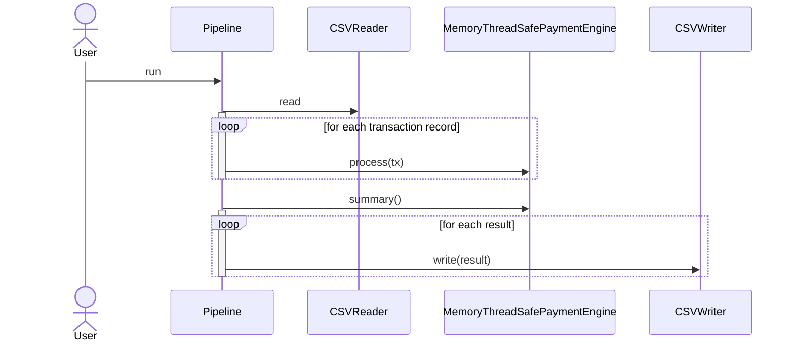
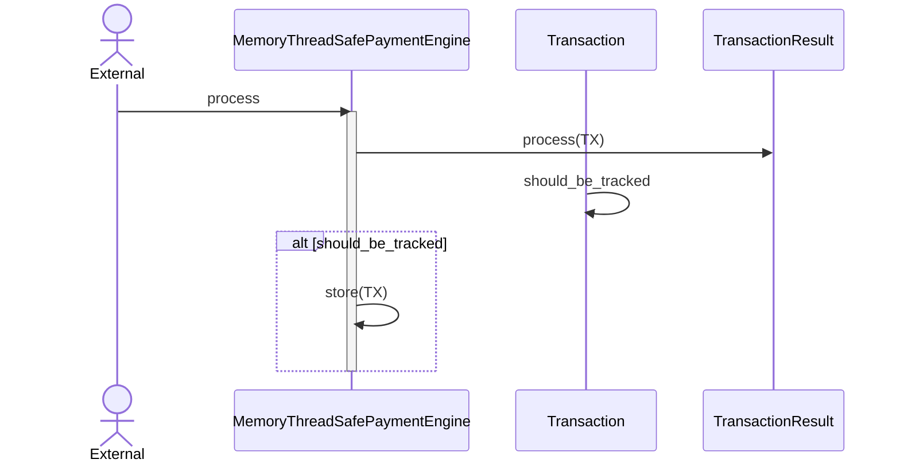

# Distributed Shared Secrets Example

In this section, I will explore a minimalistic implementation of a Distributed Shared Secret using [Shamir's secret sharing](https://en.wikipedia.org/wiki/Shamir%27s_secret_sharing) with [Proactive Refreshing](https://en.wikipedia.org/wiki/Proactive_secret_sharing).

## Table of Contents
- [Preliminaries](#preliminaries)
- [Building the Project](#building-the-project)
- [Running the Program](#running-the-program)
- [Design Documentation](#design-documentation)
    - [Design Principles](#design-principles)
    - [Modules](#modules)
    - [Assumptions](#assumptions)
    - [Extensibility and Maintainability](#extensibility-and-maintainability)
    - [Error Handling](#error-handling)
    - [Testing](#testing)
- [Future Work](#future-work)
- [Conclusions](#conclusions)

---

## Preliminaries

### Rust requirements

- **Cargo**: `cargo 1.72+`.
- **Rustc**: `rustc 1.72+`.
- **Cargo Make**: `cargo make 0.37+`

### Docker requirements

- **Docker**: `24+`
- **Docker Compose**: `2.21+`

### System requirements

- **Protobuf Compiler**: `3.21+`
> This is needed because there is a dependency with `riteraft` crate which requires protobuf binaries

---

## Building the Project

To build the project, run the following commands:

### Building with Rust

```shell
> cargo build
```

---

## Running the Program
The solution contains 2 binaries *Client* and *Server*

The main program reads data from a **CSV** file and writes the results to **stdout**.

To test the program with a substantial **CSV** file, you will need to either generate one or have it available in your local environment. The examples under the `data` folder and `tests/data` folder are simple and do not represent real-world scenarios.

### Running with Rust

```shell
> cargo run -- my_path_to_my.csv > my_result.csv
```

### Running with Docker
When using **Docker**, you need to mount your local disk as a volume. If your **CSV** file is located at `/home/your_user/data/my_csv.csv`, follow these steps:

- Build the Docker image as explained in the Building with Docker section.
- Run the Docker image using the following command:

```shell
> docker run -v /home/your_user/data/my_csv.csv:/app/data payments /app/data/my_csv.csv
```

### Run with logging

```shell
> RUST_LOG=warn cargo run -- my_path_to_my.csv > my_result.csv
```

> NOTE: Running with logging enable will redirect logging output to the stderr. Only results of the transaction processor will be redirected to stdout in order to have control on the stdout and stderr redirection for the user.

---

## Design Documentation
In this section, I will describe all the assumptions, decisions, and pending improvements that led to the current state of this software.

### Design Principles

- **P1: Extensible**: Fundaments of this can be found in [Extensibility](#extensibility-and-maintainability) section.
- **P2: Single Responsibility**: Each module and Type has a single responsibility.
- **P3: Composable**: `program` module is designed with the principle in mind that you can compose different `Source`, `PaymentEngine` and `Sink` implementations. Also **P2** enables this principle.
- **P4: Testability**: Splitting different parts of the logic as exposed before, allows to test both each piece isolated and all integrated togheter. This is enable by **P2** as well.
- **P5: Thread Safe**: Critical parts are encoded using Thread Safe types.

### Modules

- `program`: This module contains the definition of the pipeline trait and its implementations for running a program that reads transactions from some `Source`, process them with some `PaymentEngine`, and writes to some `Sink`.
- `io`: This module contains the definition of implementation types for `Source` and `Sink`
- `io::csv`: Submodule that contains implementation types for dealing with CSV files as a source and destination.
- `domain`: Module that describe domain entities and errors.
- `domain::entities`: Module that contains main entities such as `Transaction`, `TransactionResult`, etc.
- `domain::errors`: Although there is only 1 enum type for the whole errors, this module was conceived separated for future extensions and implementations.
- `engine`: Module that contains Transaction Processors Engines. Only trait definition
- `engine::memory`: Module that contains Implementation of Transaction processing based on memory

### Diagrams

#### Sequence Diagram
The following sequence diagrams outline the main flows of the system:

1. Main program



2. Process Transaction



### Assumptions

Here are some of the assumptions that were made during the development of this software:

- AS_1: **Thread Safe**: Although the program is not processing transactions concurrently, which could have been ideally based on the fact that the transactions can be split among threads, all the processing is protected by Thread Safe Types to enable the program be run in a concurrent context.

- AS_2: **Transaction IDs** are not globally unique. What makes a transaction unique is the combination of the **Transaction ID and Client ID**. It is assumed that **Transaction IDs** can be repeated among Clients. To accommodate this, the `MemoryThreadSafePaymentEngine` implementation includes special storage in memory to track transactions by Client.

- AS_3: Although it would be ideal to split transactions into chunks and process them in different threads, for simplicity and to focus on the account settlement problem, this approach was not taken. However, the only implementation of `PaymentEngine` provided is thread-safe, allowing it to be used across multiple threads. There is a test within `engine::memory` that verifies this behavior.

- AS_4: It is assumed that the following errors would stop the program rather than continuing to process transactions, as these indicate incorrect sets of transactions that need verification:

    - Any parse error of the CSV.
    - Any other unexpected errors.
    - **Overflow in numbers** is not controlled, as we rely on the runtime system and compiler to handle this.

- AS_5: Logging is implemented only to track skipped transactions because of logical errors, like wrong dispute insufficient founds, etc. If you want to activate logging, which is going to be redirected to `stderr` you should run program with the indications [above](#run-with-logging)

### Extensibility and Maintainability

The design supports extensibility and maintainability in the following ways:

- Program Pipeline Module `program`, is a module that represent who the different pieces can be composed and structured independently of the implementation. In this example we are showing a single implementation based on CSV reader, writer, and Memory Thread Safe transaction processing. But it is clear to the reader of that module that this module allows extensibility, keeping the main logic of the program intact. In the future we can implement a `TCPReader` and `TCPWriter` and compose using the same `Pipeline::run` program. You can check documentation [here](doc/payment-settle-accounts/program/index.html).

- All processing is based on the `PaymentEngine` trait, allowing for future implementations with different semantics, such as using Kafka and a database for storage and messaging.

- The settlement logic is encapsulated within the `Transaction` type, making it the central place to modify or investigate any issues related to the software.

- Each module and important function has been thoroughly tested.

#### Example of Extending Transaction Pipeline Processor

This example can be found [here](doc/payment-settle-accounts/program/index.html).

```rust
use std::net::{TcpStream, TcpListener};
use std::io::{BufReader, BufWriter};
use std::thread;

// Define TCPSource struct implementing Pipeline trait
struct TCPSource {
    stream: TcpStream,
}

impl Pipeline for TCPSource {
    fn run(&mut self) -> Result<(), TransactionError> {
        // Implement TCPSource pipeline logic here
        Ok(())
    }
}

// Define TCPSink struct implementing Pipeline trait
struct TCPSink {
    listener: TcpListener,
}

impl Pipeline for TCPSink {
    fn run(&mut self) -> Result<(), TransactionError> {
        // Implement TCPSink pipeline logic here
        Ok(())
    }
}

// Compose TransactionPipeline with TCPSource and TCPSink
let pipeline: Box<dyn Pipeline> = Box::new(TransactionPipeline {
    source: TCPSource { stream: TcpStream::connect("127.0.0.1:8080").unwrap() },
    filter: MemoryThreadSafePaymentEngine::new(),
    sink: TCPSink { listener: TcpListener::bind("127.0.0.1:8081").unwrap() },
});
```

### Error Handling

All error handling are based on `thiserror` crate using an enum and relying on `Result` type.
There are 2 kind of errors:

- **Reporting Errors**: This errors are logical errors that allow us to continue with the execution of the program but we want to logging some how without breaking the execution. An example of this, it is a transaction that wants to withdraw but there are not enough funds. In this cases we are going to handle those errors and report it with `env_logger` crate in `warn` mode. If `RUST_LOG` env variable is set the error will be display in the console but not redirected to the `stdout`, only to the `stderr`. Check [here](#run-with-logging).

- **Unexpected Errors**: This errors will not be handle and it will be propagated to the main function. Some example of this kind of errors are completely wrong formatted CSV, or some OS Signal like SIGTERM or anyother unexpected.

### Testing

All the testing are unit test against custom created data either encoded in the test itself or in files under `data` and `tests/data` folders.
I used to have `proptest` configured with some cases but I removed it because it made less clean the code in `entities` module.

---

## Future Work
This exercise left many opportunities for improving the current solution that could be addressed in future implementations:

- Implement observability.
- Implement partitioning and multithreading to process transactions concurrently in chunks.
- Implement different `PaymentEngine` implementations to reduce reliance on in-memory storage.

---

## Conclusions
Having worked on various highly distributed and transactional systems, it's fascinating how seemingly simple problems like these can still be challenging due to their sensitive nature. Despite this, it's remarkable how Rust facilitates the development of safe and secure solutions in a relatively short amount of time, with minimal external dependencies.

I thoroughly enjoyed working on this exercise, and I hope readers find it equally engaging. Your feedback and observations are welcome!
